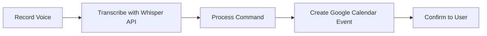

# DORA - Urdu Voice Scheduler 🎙️📅

<div align="center">


[](https://dora-urdu-voice-scheduler.vercel.app/)

*Schedule events using Urdu voice commands and Google Calendar integration*

[Features](#features) • [Demo](#live-demo) • [Getting Started](#getting-started) • [Usage](#usage) • [Contributing](#contributing) • [Roadmap](#roadmap)

</div>

## 🌟 Overview

DORA is a modern web application that enables users to schedule calendar events using **Urdu voice commands**, providing a seamless integration with Google Calendar. The application leverages cutting-edge technologies to deliver a responsive and intuitive user experience.

## ✨ Features

- **🗣️ Urdu Voice Scheduling** - Record voice commands in Urdu to create events
- **📆 Google Calendar Integration** - View, create, update, and delete calendar events
- **🔐 Secure Authentication** - Google OAuth via NextAuth.js
- **📱 Responsive Design** - Optimized for all devices
- **🐞 Debug Tools** - Real-time debugging information

## 🔧 Tech Stack

<div align="center">

| Frontend | Backend | APIs | Authentication |
|:--------:|:-------:|:----:|:-------------:|
| Next.js | Node.js | Google Calendar | NextAuth.js |
| React | API Routes | OpenAI Whisper | Google OAuth |
| Tailwind CSS | | Web Speech API | |
| Radix UI | | | |

</div>

## 🚀 Live Demo

Try out DORA at: [https://dora-urdu-voice-scheduler.vercel.app/](https://dora-urdu-voice-scheduler.vercel.app/)

## 📋 Getting Started

### Prerequisites

- **Node.js** (v16+)
- **pnpm** package manager
- **Google Cloud Project** with Calendar API enabled
- **OpenAI API Key** for Whisper transcription

### Installation

1. **Clone the repository**
   ```bash
   git clone https://github.com/abdullaharif381/dora-a3
   cd dora-a3
   ```

2. **Install dependencies**
   ```bash
   pnpm install
   ```

3. **Configure environment variables**

   Create a `.env.local` file in the root directory:
   ```
   GOOGLE_CLIENT_ID=your-google-client-id
   GOOGLE_CLIENT_SECRET=your-google-client-secret
   OPENAI_API_KEY=your-openai-api-key
   NEXTAUTH_SECRET=your-nextauth-secret
   NEXTAUTH_URL=http://localhost:3000
   ```

### Development

```bash
# Start development server
pnpm dev

# Build for production
pnpm build

# Start production server
pnpm start
```

Access the application at `http://localhost:3000`

## 🔍 Usage

1. **Sign in** with your Google account
2. **Record Voice** - Click the "Record" button and speak in Urdu
3. **Manage Events** - Create, view, update or delete events
4. **Review** - Check the debug section for processing information

### Voice Command Flow



## 💡 Core Functionality

- **Voice Processing** - Records Urdu speech and transcribes it via OpenAI Whisper API
- **Natural Language Understanding** - Extracts event details from transcribed text
- **Calendar Management** - Creates, updates, and deletes events in Google Calendar
- **Authentication** - Secures user data with Google OAuth

## 👥 Contributing

Contributions are welcome! To contribute:

1. Fork the repository
2. Create a feature branch (`git checkout -b feature/amazing-feature`)
3. Commit your changes (`git commit -m 'Add amazing feature'`)
4. Push to your branch (`git push origin feature/amazing-feature`)
5. Open a Pull Request

Please ensure your code follows the project's coding standards and includes tests where applicable.

## 🗺️ Roadmap

- **🤖 Chatbot Interface** - Interactive scheduling experience
- **👥 Multi-User Support** - Independent calendar management for teams
- **🔊 Enhanced Voice Recognition** - Improved Urdu language processing
- **📱 Mobile App** - Native iOS and Android applications
- **🌙 Dark Mode** - Enhanced visual experience
- **🌐 Multi-Language Support** - Extend beyond Urdu
- **📊 Analytics Dashboard** - Insights into scheduled events
- **📴 Offline Support** - Function without internet connection
- **🔄 Event Collaboration** - Share and collaborate on events

## 📜 License

This project is licensed under the MIT License - see the [LICENSE](LICENSE) file for details.

## 🙏 Acknowledgements

- [Next.js](https://nextjs.org/) - React framework
- [Tailwind CSS](https://tailwindcss.com/) - Utility-first CSS framework
- [Radix UI](https://www.radix-ui.com/) - Unstyled, accessible components
- [Google Calendar API](https://developers.google.com/calendar) - Calendar integration
- [OpenAI Whisper](https://openai.com/research/whisper) - Speech recognition
- [Web Speech API](https://developer.mozilla.org/en-US/docs/Web/API/Web_Speech_API) - Voice recording

## Contributors
- [Ibtehaj Ali](https://github.com/Ibtehaj778/)
- [Tahmooras Khan](https://www.linkedin.com/in/tahmooras-khan-8341452a1/)
- [Kabir ud Din Shahab]([https://developers.google.com/calend](https://www.linkedin.com/in/kabir-ud-din-shahab-230469262/))

---

<div align="center">
  <sub>Built with ❤️ by Abdullah Arif</sub>
</div>
