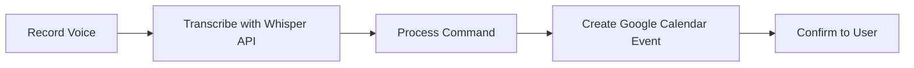

# DORA - Urdu Voice Scheduler 🎙️📅

<div align="center">


[](https://dora-urdu-voice-scheduler.vercel.app/)

*An intelligent voice-powered scheduling assistant with natural language understanding in Urdu*

[Features](#-features) • [Demo](#-live-demo) • [Installation](#-installation) • [Usage](#-usage) • [Contributing](#-contributing) • [License](#-license)

</div>

## 🌟 Project Overview

**DORA** is an advanced web application that enables users to schedule calendar events using **Urdu voice commands**. Built with modern web technologies, DORA transcribes Urdu speech into text, extracts event details, and automatically schedules them in Google Calendar. The application also features a sophisticated RAG-based chatbot that can answer questions about scheduled events by retrieving relevant information from a vector database.

This project demonstrates the practical application of voice technology, natural language processing, and semantic search to create a seamless, accessible scheduling experience for Urdu-speaking users.

## ✨ Features

### 🎤 Voice Transcription
- Records Urdu voice input through an intuitive interface
- Leverages **OpenAI's Whisper API** for accurate transcription of Urdu speech
- Supports various Urdu dialects and accents

### 📝 Task Extraction
- Analyzes transcribed text using **OpenAI's GPT-4o** model
- Intelligently extracts event details such as title, date, time, location, and participants
- Handles relative time expressions in Urdu (e.g., "کل" for tomorrow, "اگلے ہفتے" for next week)
- Ensures all events are scheduled for future dates

### 🤖 Chatbot Integration
- Implements a **Retrieval-Augmented Generation (RAG)** architecture
- Stores event data as **BERT embeddings** in **Pinecone** vector database
- Enables semantic search for retrieving relevant calendar information
- Answers natural language queries about scheduled events (e.g., "When is my meeting with Abdullah Arif?")
- Provides contextual responses based on the user's calendar data

### 🔐 Authentication
- Secure authentication using **Google OAuth 2.0** via **NextAuth.js**
- Protects user data and calendar access
- Maintains persistent sessions with JWT tokens

### 📅 Calendar Integration
- Seamless integration with **Google Calendar API**
- View, create, edit, and delete calendar events
- Multiple calendar views (day, week, month)
- Real-time synchronization of events

### 🌐 Additional Features
- **Responsive Design**: Optimized for mobile, tablet, and desktop
- **Timezone Management**: Support for various timezones
- **Debug Tools**: Real-time debugging information
- **RTL Support**: Right-to-left layout for Urdu interface

## 🔧 Tech Stack

<div align="center">

| Frontend | Backend | AI & Data | Authentication |
|:--------:|:-------:|:---------:|:-------------:|
| Next.js | Node.js | OpenAI Whisper | NextAuth.js |
| React | API Routes | GPT-4o | Google OAuth |
| Tailwind CSS | TypeScript | Pinecone | JWT |
| Radix UI | date-fns-tz | BERT Embeddings | |

</div>

## 🚀 Live Demo

Experience DORA at: [https://dora-urdu-voice-scheduler.vercel.app/](https://dora-urdu-voice-scheduler.vercel.app/)

## 📋 Installation

### Prerequisites

- **Node.js** (v16+)
- **pnpm** package manager
- **Google Cloud Project** with Calendar API enabled
- **OpenAI API Key** for Whisper transcription and GPT models
- **Pinecone API Key** for vector database

### Setup Steps

1. **Clone the repository**
   ```bash
   git clone https://github.com/abdullaharif381/dora-a3
   cd dora-a3
   ```

2. **Install dependencies**
   ```bash
   pnpm install
   ```

3. **Configure environment variables**

   Create a `.env.local` file in the root directory:
   ```
   GOOGLE_CLIENT_ID=your-google-client-id
   GOOGLE_CLIENT_SECRET=your-google-client-secret
   OPENAI_API_KEY=your-openai-api-key
   NEXTAUTH_SECRET=your-nextauth-secret
   NEXTAUTH_URL=http://localhost:3000
   ```

### Development

```bash
# Start development server
pnpm dev

# Build for production
pnpm build

# Start production server
pnpm start
```

Access the application at `http://localhost:3000`

## 🔍 Usage

1. **Sign in** with your Google account
2. **Record Voice** - Click the "Record" button and speak in Urdu
3. **Manage Events** - Create, view, update or delete events
4. **Review** - Check the debug section for processing information

### Voice Command Flow



## 💡 Core Functionality

- **Voice Processing** - Records Urdu speech and transcribes it via OpenAI Whisper API
- **Natural Language Understanding** - Extracts event details from transcribed text
- **Calendar Management** - Creates, updates, and deletes events in Google Calendar
- **Authentication** - Secures user data with Google OAuth

## 👥 Contributing

Contributions are welcome! To contribute:

1. Fork the repository
2. Create a feature branch (`git checkout -b feature/amazing-feature`)
3. Commit your changes (`git commit -m 'Add amazing feature'`)
4. Push to your branch (`git push origin feature/amazing-feature`)
5. Open a Pull Request

Please ensure your code follows the project's coding standards and includes tests where applicable.

## 🗺️ Roadmap

- **🤖 Chatbot Interface** - Interactive scheduling experience
- **👥 Multi-User Support** - Independent calendar management for teams
- **🔊 Enhanced Voice Recognition** - Improved Urdu language processing
- **📱 Mobile App** - Native iOS and Android applications
- **🌙 Dark Mode** - Enhanced visual experience
- **🌐 Multi-Language Support** - Extend beyond Urdu
- **📊 Analytics Dashboard** - Insights into scheduled events
- **📴 Offline Support** - Function without internet connection
# DORA - Urdu Voice Scheduler 🎙️📅

<div align="center">


[](https://dora-urdu-voice-scheduler.vercel.app/)

*An intelligent voice-powered scheduling assistant with natural language understanding in Urdu*

[Features](#-features) • [Demo](#-live-demo) • [Installation](#-installation) • [Usage](#-usage) • [Contributing](#-contributing) • [License](#-license)

</div>

## 🌟 Project Overview

**DORA** is an advanced web application that enables users to schedule calendar events using **Urdu voice commands**. Built with modern web technologies, DORA transcribes Urdu speech into text, extracts event details, and automatically schedules them in Google Calendar. The application also features a sophisticated RAG-based chatbot that can answer questions about scheduled events by retrieving relevant information from a vector database.

This project demonstrates the practical application of voice technology, natural language processing, and semantic search to create a seamless, accessible scheduling experience for Urdu-speaking users.

## ✨ Features

### 🎤 Voice Transcription
- Records Urdu voice input through an intuitive interface
- Leverages **OpenAI's Whisper API** for accurate transcription of Urdu speech
- Supports various Urdu dialects and accents

### 📝 Task Extraction
- Analyzes transcribed text using **OpenAI's GPT-4o** model
- Intelligently extracts event details such as title, date, time, location, and participants
- Handles relative time expressions in Urdu (e.g., "کل" for tomorrow, "اگلے ہفتے" for next week)
- Ensures all events are scheduled for future dates

### 🤖 Chatbot Integration
- Implements a **Retrieval-Augmented Generation (RAG)** architecture
- Stores event data as **BERT embeddings** in **Pinecone** vector database
- Enables semantic search for retrieving relevant calendar information
- Answers natural language queries about scheduled events (e.g., "When is my meeting with Abdullah Arif?")
- Provides contextual responses based on the user's calendar data

### 🔐 Authentication
- Secure authentication using **Google OAuth 2.0** via **NextAuth.js**
- Protects user data and calendar access
- Maintains persistent sessions with JWT tokens

### 📅 Calendar Integration
- Seamless integration with **Google Calendar API**
- View, create, edit, and delete calendar events
- Multiple calendar views (day, week, month)
- Real-time synchronization of events

### 🌐 Additional Features
- **Responsive Design**: Optimized for mobile, tablet, and desktop
- **Timezone Management**: Support for various timezones
- **Debug Tools**: Real-time debugging information
- **RTL Support**: Right-to-left layout for Urdu interface

## 🔧 Tech Stack

<div align="center">

| Frontend | Backend | AI & Data | Authentication |
|:--------:|:-------:|:---------:|:-------------:|
| Next.js | Node.js | OpenAI Whisper | NextAuth.js |
| React | API Routes | GPT-4o | Google OAuth |
| Tailwind CSS | TypeScript | Pinecone | JWT |
| Radix UI | date-fns-tz | BERT Embeddings | |

</div>

## 🚀 Live Demo

Experience DORA at: [https://dora-urdu-voice-scheduler.vercel.app/](https://dora-urdu-voice-scheduler.vercel.app/)

## 📋 Installation

### Prerequisites

- **Node.js** (v16+)
- **pnpm** package manager
- **Google Cloud Project** with Calendar API enabled
- **OpenAI API Key** for Whisper transcription and GPT models
- **Pinecone API Key** for vector database

### Setup Steps

1. **Clone the repository**
   ```bash
   git clone https://github.com/abdullaharif381/dora-a3
   cd dora-a3
   ```

2. **Install dependencies**
   ```bash
   pnpm install
   ```

3. **Configure environment variables**

   Create a `.env.local` file in the root directory:
   ```
   GOOGLE_CLIENT_ID=your-google-client-id
   GOOGLE_CLIENT_SECRET=your-google-client-secret
   OPENAI_API_KEY=your-openai-api-key
   NEXTAUTH_SECRET=your-nextauth-secret
   NEXTAUTH_URL=http://localhost:3000
   ```

### Development

```bash
# Start development server
pnpm dev

# Build for production
pnpm build

# Start production server
pnpm start
```

Access the application at `http://localhost:3000`

## 🔍 Usage

1. **Sign in** with your Google account
2. **Record Voice** - Click the "Record" button and speak in Urdu
3. **Manage Events** - Create, view, update or delete events
4. **Review** - Check the debug section for processing information

### Voice Command Flow


## 💡 Core Functionality

- **Voice Processing** - Records Urdu speech and transcribes it via OpenAI Whisper API
- **Natural Language Understanding** - Extracts event details from transcribed text
- **Calendar Management** - Creates, updates, and deletes events in Google Calendar
- **Authentication** - Secures user data with Google OAuth

## 👥 Contributing

Contributions are welcome! To contribute:

1. Fork the repository
2. Create a feature branch (`git checkout -b feature/amazing-feature`)
3. Commit your changes (`git commit -m 'Add amazing feature'`)
4. Push to your branch (`git push origin feature/amazing-feature`)
5. Open a Pull Request

Please ensure your code follows the project's coding standards and includes tests where applicable.

## 🗺️ Roadmap

- **🤖 Chatbot Interface** - Interactive scheduling experience
- **👥 Multi-User Support** - Independent calendar management for teams
- **🔊 Enhanced Voice Recognition** - Improved Urdu language processing
- **📱 Mobile App** - Native iOS and Android applications
- **🌙 Dark Mode** - Enhanced visual experience
- **🌐 Multi-Language Support** - Extend beyond Urdu
- **📊 Analytics Dashboard** - Insights into scheduled events
- **📴 Offline Support** - Function without internet connection
# DORA - Urdu Voice Scheduler 🎙️📅

<div align="center">


[](https://dora-urdu-voice-scheduler.vercel.app/)

*An intelligent voice-powered scheduling assistant with natural language understanding in Urdu*

[Features](#-features) • [Demo](#-live-demo) • [Installation](#-installation) • [Usage](#-usage) • [Contributing](#-contributing) • [License](#-license)

</div>

## 🌟 Project Overview

**DORA** is an advanced web application that enables users to schedule calendar events using **Urdu voice commands**. Built with modern web technologies, DORA transcribes Urdu speech into text, extracts event details, and automatically schedules them in Google Calendar. The application also features a sophisticated RAG-based chatbot that can answer questions about scheduled events by retrieving relevant information from a vector database.

This project demonstrates the practical application of voice technology, natural language processing, and semantic search to create a seamless, accessible scheduling experience for Urdu-speaking users.

## ✨ Features

### 🎤 Voice Transcription
- Records Urdu voice input through an intuitive interface
- Leverages **OpenAI's Whisper API** for accurate transcription of Urdu speech
- Supports various Urdu dialects and accents

### 📝 Task Extraction
- Analyzes transcribed text using **OpenAI's GPT-4o** model
- Intelligently extracts event details such as title, date, time, location, and participants
- Handles relative time expressions in Urdu (e.g., "کل" for tomorrow, "اگلے ہفتے" for next week)
- Ensures all events are scheduled for future dates

### 🤖 Chatbot Integration
- Implements a **Retrieval-Augmented Generation (RAG)** architecture
- Stores event data as **BERT embeddings** in **Pinecone** vector database
- Enables semantic search for retrieving relevant calendar information
- Answers natural language queries about scheduled events (e.g., "When is my meeting with Abdullah Arif?")
- Provides contextual responses based on the user's calendar data

### 🔐 Authentication
- Secure authentication using **Google OAuth 2.0** via **NextAuth.js**
- Protects user data and calendar access
- Maintains persistent sessions with JWT tokens

### 📅 Calendar Integration
- Seamless integration with **Google Calendar API**
- View, create, edit, and delete calendar events
- Multiple calendar views (day, week, month)
- Real-time synchronization of events

### 🌐 Additional Features
- **Responsive Design**: Optimized for mobile, tablet, and desktop
- **Timezone Management**: Support for various timezones
- **Debug Tools**: Real-time debugging information
- **RTL Support**: Right-to-left layout for Urdu interface

## 🔧 Tech Stack

<div align="center">

| Frontend | Backend | AI & Data | Authentication |
|:--------:|:-------:|:---------:|:-------------:|
| Next.js | Node.js | OpenAI Whisper | NextAuth.js |
| React | API Routes | GPT-4o | Google OAuth |
| Tailwind CSS | TypeScript | Pinecone | JWT |
| Radix UI | date-fns-tz | BERT Embeddings | |

</div>

## 🚀 Live Demo

Experience DORA at: [https://dora-urdu-voice-scheduler.vercel.app/](https://dora-urdu-voice-scheduler.vercel.app/)

## 📋 Installation

### Prerequisites

- **Node.js** (v16+)
- **pnpm** package manager
- **Google Cloud Project** with Calendar API enabled
- **OpenAI API Key** for Whisper transcription and GPT models
- **Pinecone API Key** for vector database

### Setup Steps

1. **Clone the repository**
   ```bash
   git clone https://github.com/abdullaharif381/dora-a3
   cd dora-a3
   ```

2. **Install dependencies**
   ```bash
   pnpm install
   ```

3. **Configure environment variables**

   Create a `.env.local` file in the root directory:
   ```
   GOOGLE_CLIENT_ID=your-google-client-id
   GOOGLE_CLIENT_SECRET=your-google-client-secret
   OPENAI_API_KEY=your-openai-api-key
   NEXTAUTH_SECRET=your-nextauth-secret
   NEXTAUTH_URL=http://localhost:3000
   ```

### Development

```bash
# Start development server
pnpm dev

# Build for production
pnpm build

# Start production server
pnpm start
```

Access the application at `http://localhost:3000`

## 🔍 Usage

1. **Sign in** with your Google account
2. **Record Voice** - Click the "Record" button and speak in Urdu
3. **Manage Events** - Create, view, update or delete events
4. **Review** - Check the debug section for processing information

### Voice Command Flow


## 💡 Core Functionality

- **Voice Processing** - Records Urdu speech and transcribes it via OpenAI Whisper API
- **Natural Language Understanding** - Extracts event details from transcribed text
- **Calendar Management** - Creates, updates, and deletes events in Google Calendar
- **Authentication** - Secures user data with Google OAuth

## 👥 Contributing

Contributions are welcome! To contribute:

1. Fork the repository
2. Create a feature branch (`git checkout -b feature/amazing-feature`)
3. Commit your changes (`git commit -m 'Add amazing feature'`)
4. Push to your branch (`git push origin feature/amazing-feature`)
5. Open a Pull Request

Please ensure your code follows the project's coding standards and includes tests where applicable.

## 🗺️ Roadmap

- **🤖 Chatbot Interface** - Interactive scheduling experience
- **👥 Multi-User Support** - Independent calendar management for teams
- **🔊 Enhanced Voice Recognition** - Improved Urdu language processing
- **📱 Mobile App** - Native iOS and Android applications
- **🌙 Dark Mode** - Enhanced visual experience
- **🌐 Multi-Language Support** - Extend beyond Urdu
- **📊 Analytics Dashboard** - Insights into scheduled events
- **📴 Offline Support** - Function without internet connection
# DORA - Urdu Voice Scheduler 🎙️📅

<div align="center">


[](https://dora-urdu-voice-scheduler.vercel.app/)

*An intelligent voice-powered scheduling assistant with natural language understanding in Urdu*

[Features](#-features) • [Demo](#-live-demo) • [Installation](#-installation) • [Usage](#-usage) • [Contributing](#-contributing) • [License](#-license)

</div>

## 🌟 Project Overview

**DORA** is an advanced web application that enables users to schedule calendar events using **Urdu voice commands**. Built with modern web technologies, DORA transcribes Urdu speech into text, extracts event details, and automatically schedules them in Google Calendar. The application also features a sophisticated RAG-based chatbot that can answer questions about scheduled events by retrieving relevant information from a vector database.

This project demonstrates the practical application of voice technology, natural language processing, and semantic search to create a seamless, accessible scheduling experience for Urdu-speaking users.

## ✨ Features

### 🎤 Voice Transcription
- Records Urdu voice input through an intuitive interface
- Leverages **OpenAI's Whisper API** for accurate transcription of Urdu speech
- Supports various Urdu dialects and accents

### 📝 Task Extraction
- Analyzes transcribed text using **OpenAI's GPT-4o** model
- Intelligently extracts event details such as title, date, time, location, and participants
- Handles relative time expressions in Urdu (e.g., "کل" for tomorrow, "اگلے ہفتے" for next week)
- Ensures all events are scheduled for future dates

### 🤖 Chatbot Integration
- Implements a **Retrieval-Augmented Generation (RAG)** architecture
- Stores event data as **BERT embeddings** in **Pinecone** vector database
- Enables semantic search for retrieving relevant calendar information
- Answers natural language queries about scheduled events (e.g., "When is my meeting with Abdullah Arif?")
- Provides contextual responses based on the user's calendar data

### 🔐 Authentication
- Secure authentication using **Google OAuth 2.0** via **NextAuth.js**
- Protects user data and calendar access
- Maintains persistent sessions with JWT tokens

### 📅 Calendar Integration
- Seamless integration with **Google Calendar API**
- View, create, edit, and delete calendar events
- Multiple calendar views (day, week, month)
- Real-time synchronization of events

### 🌐 Additional Features
- **Responsive Design**: Optimized for mobile, tablet, and desktop
- **Timezone Management**: Support for various timezones
- **Debug Tools**: Real-time debugging information
- **RTL Support**: Right-to-left layout for Urdu interface

## 🔧 Tech Stack

<div align="center">

| Frontend | Backend | AI & Data | Authentication |
|:--------:|:-------:|:---------:|:-------------:|
| Next.js | Node.js | OpenAI Whisper | NextAuth.js |
| React | API Routes | GPT-4o | Google OAuth |
| Tailwind CSS | TypeScript | Pinecone | JWT |
| Radix UI | date-fns-tz | BERT Embeddings | |

</div>

## 🚀 Live Demo

Experience DORA at: [https://dora-urdu-voice-scheduler.vercel.app/](https://dora-urdu-voice-scheduler.vercel.app/)

## 📋 Installation

### Prerequisites

- **Node.js** (v16+)
- **pnpm** package manager
- **Google Cloud Project** with Calendar API enabled
- **OpenAI API Key** for Whisper transcription and GPT models
- **Pinecone API Key** for vector database

### Setup Steps

1. **Clone the repository**
   ```bash
   git clone https://github.com/abdullaharif381/dora-a3
   cd dora-a3
   ```

2. **Install dependencies**
   ```bash
   pnpm install
   ```

3. **Configure environment variables**

   Create a `.env.local` file in the root directory:
   ```
   GOOGLE_CLIENT_ID=your-google-client-id
   GOOGLE_CLIENT_SECRET=your-google-client-secret
   OPENAI_API_KEY=your-openai-api-key
   NEXTAUTH_SECRET=your-nextauth-secret
   NEXTAUTH_URL=http://localhost:3000
   ```

### Development

```bash
# Start development server
pnpm dev

# Build for production
pnpm build

# Start production server
pnpm start
```

Access the application at `http://localhost:3000`

## 🔍 Usage

1. **Sign in** with your Google account
2. **Record Voice** - Click the "Record" button and speak in Urdu
3. **Manage Events** - Create, view, update or delete events
4. **Review** - Check the debug section for processing information

### Voice Command Flow


## 💡 Core Functionality

- **Voice Processing** - Records Urdu speech and transcribes it via OpenAI Whisper API
- **Natural Language Understanding** - Extracts event details from transcribed text
- **Calendar Management** - Creates, updates, and deletes events in Google Calendar
- **Authentication** - Secures user data with Google OAuth

## 👥 Contributing

Contributions are welcome! To contribute:

1. Fork the repository
2. Create a feature branch (`git checkout -b feature/amazing-feature`)
3. Commit your changes (`git commit -m 'Add amazing feature'`)
4. Push to your branch (`git push origin feature/amazing-feature`)
5. Open a Pull Request

Please ensure your code follows the project's coding standards and includes tests where applicable.

## 🗺️ Roadmap

- **🤖 Chatbot Interface** - Interactive scheduling experience
- **👥 Multi-User Support** - Independent calendar management for teams
- **🔊 Enhanced Voice Recognition** - Improved Urdu language processing
- **📱 Mobile App** - Native iOS and Android applications
- **🌙 Dark Mode** - Enhanced visual experience
- **🌐 Multi-Language Support** - Extend beyond Urdu
- **📊 Analytics Dashboard** - Insights into scheduled events
- **📴 Offline Support** - Function without internet connection
# DORA - Urdu Voice Scheduler 🎙️📅

<div align="center">


[](https://dora-urdu-voice-scheduler.vercel.app/)

*An intelligent voice-powered scheduling assistant with natural language understanding in Urdu*

[Features](#-features) • [Demo](#-live-demo) • [Installation](#-installation) • [Usage](#-usage) • [Contributing](#-contributing) • [License](#-license)

</div>

## 🌟 Project Overview

**DORA** is an advanced web application that enables users to schedule calendar events using **Urdu voice commands**. Built with modern web technologies, DORA transcribes Urdu speech into text, extracts event details, and automatically schedules them in Google Calendar. The application also features a sophisticated RAG-based chatbot that can answer questions about scheduled events by retrieving relevant information from a vector database.

This project demonstrates the practical application of voice technology, natural language processing, and semantic search to create a seamless, accessible scheduling experience for Urdu-speaking users.

## ✨ Features

### 🎤 Voice Transcription
- Records Urdu voice input through an intuitive interface
- Leverages **OpenAI's Whisper API** for accurate transcription of Urdu speech
- Supports various Urdu dialects and accents

### 📝 Task Extraction
- Analyzes transcribed text using **OpenAI's GPT-4o** model
- Intelligently extracts event details such as title, date, time, location, and participants
- Handles relative time expressions in Urdu (e.g., "کل" for tomorrow, "اگلے ہفتے" for next week)
- Ensures all events are scheduled for future dates

### 🤖 Chatbot Integration
- Implements a **Retrieval-Augmented Generation (RAG)** architecture
- Stores event data as **BERT embeddings** in **Pinecone** vector database
- Enables semantic search for retrieving relevant calendar information
- Answers natural language queries about scheduled events (e.g., "When is my meeting with Abdullah Arif?")
- Provides contextual responses based on the user's calendar data

### 🔐 Authentication
- Secure authentication using **Google OAuth 2.0** via **NextAuth.js**
- Protects user data and calendar access
- Maintains persistent sessions with JWT tokens

### 📅 Calendar Integration
- Seamless integration with **Google Calendar API**
- View, create, edit, and delete calendar events
- Multiple calendar views (day, week, month)
- Real-time synchronization of events

### 🌐 Additional Features
- **Responsive Design**: Optimized for mobile, tablet, and desktop
- **Timezone Management**: Support for various timezones
- **Debug Tools**: Real-time debugging information
- **RTL Support**: Right-to-left layout for Urdu interface

## 🔧 Tech Stack

<div align="center">

| Frontend | Backend | AI & Data | Authentication |
|:--------:|:-------:|:---------:|:-------------:|
| Next.js | Node.js | OpenAI Whisper | NextAuth.js |
| React | API Routes | GPT-4o | Google OAuth |
| Tailwind CSS | TypeScript | Pinecone | JWT |
| Radix UI | date-fns-tz | BERT Embeddings | |

</div>

## 🚀 Live Demo

Experience DORA at: [https://dora-urdu-voice-scheduler.vercel.app/](https://dora-urdu-voice-scheduler.vercel.app/)

## 📋 Installation

### Prerequisites

- **Node.js** (v16+)
- **pnpm** package manager
- **Google Cloud Project** with Calendar API enabled
- **OpenAI API Key** for Whisper transcription and GPT models
- **Pinecone API Key** for vector database

### Setup Steps

1. **Clone the repository**
   ```bash
   git clone https://github.com/abdullaharif381/dora-a3
   cd dora-a3
   ```

2. **Install dependencies**
   ```bash
   pnpm install
   ```

3. **Configure environment variables**

   Create a `.env.local` file in the root directory:
   ```
   GOOGLE_CLIENT_ID=your-google-client-id
   GOOGLE_CLIENT_SECRET=your-google-client-secret
   OPENAI_API_KEY=your-openai-api-key
   NEXTAUTH_SECRET=your-nextauth-secret
   NEXTAUTH_URL=http://localhost:3000
   ```

### Development

```bash
# Start development server
pnpm dev

# Build for production
pnpm build

# Start production server
pnpm start
```

Access the application at `http://localhost:3000`

## 🔍 Usage

1. **Sign in** with your Google account
2. **Record Voice** - Click the "Record" button and speak in Urdu
3. **Manage Events** - Create, view, update or delete events
4. **Review** - Check the debug section for processing information

### Voice Command Flow


## 💡 Core Functionality

- **Voice Processing** - Records Urdu speech and transcribes it via OpenAI Whisper API
- **Natural Language Understanding** - Extracts event details from transcribed text
- **Calendar Management** - Creates, updates, and deletes events in Google Calendar
- **Authentication** - Secures user data with Google OAuth

## 👥 Contributing

Contributions are welcome! To contribute:

1. Fork the repository
2. Create a feature branch (`git checkout -b feature/amazing-feature`)
3. Commit your changes (`git commit -m 'Add amazing feature'`)
4. Push to your branch (`git push origin feature/amazing-feature`)
5. Open a Pull Request

Please ensure your code follows the project's coding standards and includes tests where applicable.

## 🗺️ Roadmap

- **🤖 Chatbot Interface** - Interactive scheduling experience
- **👥 Multi-User Support** - Independent calendar management for teams
- **🔊 Enhanced Voice Recognition** - Improved Urdu language processing
- **📱 Mobile App** - Native iOS and Android applications
- **🌙 Dark Mode** - Enhanced visual experience
- **🌐 Multi-Language Support** - Extend beyond Urdu
- **📊 Analytics Dashboard** - Insights into scheduled events
- **📴 Offline Support** - Function without internet connection
# DORA - Urdu Voice Scheduler 🎙️📅

<div align="center">


[](https://dora-urdu-voice-scheduler.vercel.app/)

*An intelligent voice-powered scheduling assistant with natural language understanding in Urdu*

[Features](#-features) • [Demo](#-live-demo) • [Installation](#-installation) • [Usage](#-usage) • [Contributing](#-contributing) • [License](#-license)

</div>

## 🌟 Project Overview

**DORA** is an advanced web application that enables users to schedule calendar events using **Urdu voice commands**. Built with modern web technologies, DORA transcribes Urdu speech into text, extracts event details, and automatically schedules them in Google Calendar. The application also features a sophisticated RAG-based chatbot that can answer questions about scheduled events by retrieving relevant information from a vector database.

This project demonstrates the practical application of voice technology, natural language processing, and semantic search to create a seamless, accessible scheduling experience for Urdu-speaking users.

## ✨ Features

### 🎤 Voice Transcription
- Records Urdu voice input through an intuitive interface
- Leverages **OpenAI's Whisper API** for accurate transcription of Urdu speech
- Supports various Urdu dialects and accents

### 📝 Task Extraction
- Analyzes transcribed text using **OpenAI's GPT-4o** model
- Intelligently extracts event details such as title, date, time, location, and participants
- Handles relative time expressions in Urdu (e.g., "کل" for tomorrow, "اگلے ہفتے" for next week)
- Ensures all events are scheduled for future dates

### 🤖 Chatbot Integration
- Implements a **Retrieval-Augmented Generation (RAG)** architecture
- Stores event data as **BERT embeddings** in **Pinecone** vector database
- Enables semantic search for retrieving relevant calendar information
- Answers natural language queries about scheduled events (e.g., "When is my meeting with Abdullah Arif?")
- Provides contextual responses based on the user's calendar data

### 🔐 Authentication
- Secure authentication using **Google OAuth 2.0** via **NextAuth.js**
- Protects user data and calendar access
- Maintains persistent sessions with JWT tokens

### 📅 Calendar Integration
- Seamless integration with **Google Calendar API**
- View, create, edit, and delete calendar events
- Multiple calendar views (day, week, month)
- Real-time synchronization of events

### 🌐 Additional Features
- **Responsive Design**: Optimized for mobile, tablet, and desktop
- **Timezone Management**: Support for various timezones
- **Debug Tools**: Real-time debugging information
- **RTL Support**: Right-to-left layout for Urdu interface

## 🔧 Tech Stack

<div align="center">

| Frontend | Backend | AI & Data | Authentication |
|:--------:|:-------:|:---------:|:-------------:|
| Next.js | Node.js | OpenAI Whisper | NextAuth.js |
| React | API Routes | GPT-4o | Google OAuth |
| Tailwind CSS | TypeScript | Pinecone | JWT |
| Radix UI | date-fns-tz | BERT Embeddings | |

</div>

## 🚀 Live Demo

Experience DORA at: [https://dora-urdu-voice-scheduler.vercel.app/](https://dora-urdu-voice-scheduler.vercel.app/)

## 📋 Installation

### Prerequisites

- **Node.js** (v16+)
- **pnpm** package manager
- **Google Cloud Project** with Calendar API enabled
- **OpenAI API Key** for Whisper transcription and GPT models
- **Pinecone API Key** for vector database

### Setup Steps

1. **Clone the repository**
   ```bash
   git clone https://github.com/abdullaharif381/dora-a3
   cd dora-a3
   ```

2. **Install dependencies**
   ```bash
   pnpm install
   ```

3. **Configure environment variables**

   Create a `.env.local` file in the root directory:
   ```
   GOOGLE_CLIENT_ID=your-google-client-id
   GOOGLE_CLIENT_SECRET=your-google-client-secret
   OPENAI_API_KEY=your-openai-api-key
   NEXTAUTH_SECRET=your-nextauth-secret
   NEXTAUTH_URL=http://localhost:3000
   ```

### Development

```bash
# Start development server
pnpm dev

# Build for production
pnpm build

# Start production server
pnpm start
```

Access the application at `http://localhost:3000`

## 🔍 Usage

1. **Sign in** with your Google account
2. **Record Voice** - Click the "Record" button and speak in Urdu
3. **Manage Events** - Create, view, update or delete events
4. **Review** - Check the debug section for processing information

### Voice Command Flow


## 💡 Core Functionality

- **Voice Processing** - Records Urdu speech and transcribes it via OpenAI Whisper API
- **Natural Language Understanding** - Extracts event details from transcribed text
- **Calendar Management** - Creates, updates, and deletes events in Google Calendar
- **Authentication** - Secures user data with Google OAuth

## 👥 Contributing

Contributions are welcome! To contribute:

1. Fork the repository
2. Create a feature branch (`git checkout -b feature/amazing-feature`)
3. Commit your changes (`git commit -m 'Add amazing feature'`)
4. Push to your branch (`git push origin feature/amazing-feature`)
5. Open a Pull Request

Please ensure your code follows the project's coding standards and includes tests where applicable.

## 🗺️ Roadmap

- **🤖 Chatbot Interface** - Interactive scheduling experience
- **👥 Multi-User Support** - Independent calendar management for teams
- **🔊 Enhanced Voice Recognition** - Improved Urdu language processing
- **📱 Mobile App** - Native iOS and Android applications
- **🌙 Dark Mode** - Enhanced visual experience
- **🌐 Multi-Language Support** - Extend beyond Urdu
- **📊 Analytics Dashboard** - Insights into scheduled events
- **📴 Offline Support** - Function without internet connection
# DORA - Urdu Voice Scheduler 🎙️📅

<div align="center">


[](https://dora-urdu-voice-scheduler.vercel.app/)

*An intelligent voice-powered scheduling assistant with natural language understanding in Urdu*

[Features](#-features) • [Demo](#-live-demo) • [Installation](#-installation) • [Usage](#-usage) • [Contributing](#-contributing) • [License](#-license)

</div>

## 🌟 Project Overview

**DORA** is an advanced web application that enables users to schedule calendar events using **Urdu voice commands**. Built with modern web technologies, DORA transcribes Urdu speech into text, extracts event details, and automatically schedules them in Google Calendar. The application also features a sophisticated RAG-based chatbot that can answer questions about scheduled events by retrieving relevant information from a vector database.

This project demonstrates the practical application of voice technology, natural language processing, and semantic search to create a seamless, accessible scheduling experience for Urdu-speaking users.

## ✨ Features

### 🎤 Voice Transcription
- Records Urdu voice input through an intuitive interface
- Leverages **OpenAI's Whisper API** for accurate transcription of Urdu speech
- Supports various Urdu dialects and accents

### 📝 Task Extraction
- Analyzes transcribed text using **OpenAI's GPT-4o** model
- Intelligently extracts event details such as title, date, time, location, and participants
- Handles relative time expressions in Urdu (e.g., "کل" for tomorrow, "اگلے ہفتے" for next week)
- Ensures all events are scheduled for future dates

### 🤖 Chatbot Integration
- Implements a **Retrieval-Augmented Generation (RAG)** architecture
- Stores event data as **BERT embeddings** in **Pinecone** vector database
- Enables semantic search for retrieving relevant calendar information
- Answers natural language queries about scheduled events (e.g., "When is my meeting with Abdullah Arif?")
- Provides contextual responses based on the user's calendar data

### 🔐 Authentication
- Secure authentication using **Google OAuth 2.0** via **NextAuth.js**
- Protects user data and calendar access
- Maintains persistent sessions with JWT tokens

### 📅 Calendar Integration
- Seamless integration with **Google Calendar API**
- View, create, edit, and delete calendar events
- Multiple calendar views (day, week, month)
- Real-time synchronization of events

### 🌐 Additional Features
- **Responsive Design**: Optimized for mobile, tablet, and desktop
- **Timezone Management**: Support for various timezones
- **Debug Tools**: Real-time debugging information
- **RTL Support**: Right-to-left layout for Urdu interface

## 🔧 Tech Stack

<div align="center">

| Frontend | Backend | AI & Data | Authentication |
|:--------:|:-------:|:---------:|:-------------:|
| Next.js | Node.js | OpenAI Whisper | NextAuth.js |
| React | API Routes | GPT-4o | Google OAuth |
| Tailwind CSS | TypeScript | Pinecone | JWT |
| Radix UI | date-fns-tz | BERT Embeddings | |

</div>

## 🚀 Live Demo

Experience DORA at: [https://dora-urdu-voice-scheduler.vercel.app/](https://dora-urdu-voice-scheduler.vercel.app/)

## 📋 Installation

### Prerequisites

- **Node.js** (v16+)
- **pnpm** package manager
- **Google Cloud Project** with Calendar API enabled
- **OpenAI API Key** for Whisper transcription and GPT models
- **Pinecone API Key** for vector database

### Setup Steps

1. **Clone the repository**
   ```bash
   git clone https://github.com/abdullaharif381/dora-a3
   cd dora-a3
   ```

2. **Install dependencies**
   ```bash
   pnpm install
   ```

3. **Configure environment variables**

   Create a `.env.local` file in the root directory:
   ```
   GOOGLE_CLIENT_ID=your-google-client-id
   GOOGLE_CLIENT_SECRET=your-google-client-secret
   OPENAI_API_KEY=your-openai-api-key
   NEXTAUTH_SECRET=your-nextauth-secret
   NEXTAUTH_URL=http://localhost:3000
   ```

### Development

```bash
# Start development server
pnpm dev

# Build for production
pnpm build

# Start production server
pnpm start
```

Access the application at `http://localhost:3000`

## 🔍 Usage

1. **Sign in** with your Google account
2. **Record Voice** - Click the "Record" button and speak in Urdu
3. **Manage Events** - Create, view, update or delete events
4. **Review** - Check the debug section for processing information

### Voice Command Flow


## 💡 Core Functionality

- **Voice Processing** - Records Urdu speech and transcribes it via OpenAI Whisper API
- **Natural Language Understanding** - Extracts event details from transcribed text
- **Calendar Management** - Creates, updates, and deletes events in Google Calendar
- **Authentication** - Secures user data with Google OAuth

## 👥 Contributing

Contributions are welcome! To contribute:

1. Fork the repository
2. Create a feature branch (`git checkout -b feature/amazing-feature`)
3. Commit your changes (`git commit -m 'Add amazing feature'`)
4. Push to your branch (`git push origin feature/amazing-feature`)
5. Open a Pull Request

Please ensure your code follows the project's coding standards and includes tests where applicable.

## 🗺️ Roadmap

- **🤖 Chatbot Interface** - Interactive scheduling experience
- **👥 Multi-User Support** - Independent calendar management for teams
- **🔊 Enhanced Voice Recognition** - Improved Urdu language processing
- **📱 Mobile App** - Native iOS and Android applications
- **🌙 Dark Mode** - Enhanced visual experience
- **🌐 Multi-Language Support** - Extend beyond Urdu
- **📊 Analytics Dashboard** - Insights into scheduled events
- **📴 Offline Support** - Function without internet connection
# DORA - Urdu Voice Scheduler 🎙️📅

<div align="center">


[](https://dora-urdu-voice-scheduler.vercel.app/)

*An intelligent voice-powered scheduling assistant with natural language understanding in Urdu*

[Features](#-features) • [Demo](#-live-demo) • [Installation](#-installation) • [Usage](#-usage) • [Contributing](#-contributing) • [License](#-license)

</div>

## 🌟 Project Overview

**DORA** is an advanced web application that enables users to schedule calendar events using **Urdu voice commands**. Built with modern web technologies, DORA transcribes Urdu speech into text, extracts event details, and automatically schedules them in Google Calendar. The application also features a sophisticated RAG-based chatbot that can answer questions about scheduled events by retrieving relevant information from a vector database.

This project demonstrates the practical application of voice technology, natural language processing, and semantic search to create a seamless, accessible scheduling experience for Urdu-speaking users.

## ✨ Features

### 🎤 Voice Transcription
- Records Urdu voice input through an intuitive interface
- Leverages **OpenAI's Whisper API** for accurate transcription of Urdu speech
- Supports various Urdu dialects and accents

### 📝 Task Extraction
- Analyzes transcribed text using **OpenAI's GPT-4o** model
- Intelligently extracts event details such as title, date, time, location, and participants
- Handles relative time expressions in Urdu (e.g., "کل" for tomorrow, "اگلے ہفتے" for next week)
- Ensures all events are scheduled for future dates

### 🤖 Chatbot Integration
- Implements a **Retrieval-Augmented Generation (RAG)** architecture
- Stores event data as **BERT embeddings** in **Pinecone** vector database
- Enables semantic search for retrieving relevant calendar information
- Answers natural language queries about scheduled events (e.g., "When is my meeting with Abdullah Arif?")
- Provides contextual responses based on the user's calendar data

### 🔐 Authentication
- Secure authentication using **Google OAuth 2.0** via **NextAuth.js**
- Protects user data and calendar access
- Maintains persistent sessions with JWT tokens

### 📅 Calendar Integration
- Seamless integration with **Google Calendar API**
- View, create, edit, and delete calendar events
- Multiple calendar views (day, week, month)
- Real-time synchronization of events

### 🌐 Additional Features
- **Responsive Design**: Optimized for mobile, tablet, and desktop
- **Timezone Management**: Support for various timezones
- **Debug Tools**: Real-time debugging information
- **RTL Support**: Right-to-left layout for Urdu interface

## 🔧 Tech Stack

<div align="center">

| Frontend | Backend | AI & Data | Authentication |
|:--------:|:-------:|:---------:|:-------------:|
| Next.js | Node.js | OpenAI Whisper | NextAuth.js |
| React | API Routes | GPT-4o | Google OAuth |
| Tailwind CSS | TypeScript | Pinecone | JWT |
| Radix UI | date-fns-tz | BERT Embeddings | |

</div>

## 🚀 Live Demo

Experience DORA at: [https://dora-urdu-voice-scheduler.vercel.app/](https://dora-urdu-voice-scheduler.vercel.app/)

## 📋 Installation

### Prerequisites

- **Node.js** (v16+)
- **pnpm** package manager
- **Google Cloud Project** with Calendar API enabled
- **OpenAI API Key** for Whisper transcription and GPT models
- **Pinecone API Key** for vector database

### Setup Steps

1. **Clone the repository**
   ```bash
   git clone https://github.com/abdullaharif381/dora-a3
   cd dora-a3
   ```

2. **Install dependencies**
   ```bash
   pnpm install
   ```

3. **Configure environment variables**

   Create a `.env.local` file in the root directory:
   ```
   GOOGLE_CLIENT_ID=your-google-client-id
   GOOGLE_CLIENT_SECRET=your-google-client-secret
   OPENAI_API_KEY=your-openai-api-key
   NEXTAUTH_SECRET=your-nextauth-secret
   NEXTAUTH_URL=http://localhost:3000
   ```

### Development

```bash
# Start development server
pnpm dev

# Build for production
pnpm build

# Start production server
pnpm start
```

Access the application at `http://localhost:3000`

## 🔍 Usage

1. **Sign in** with your Google account
2. **Record Voice** - Click the "Record" button and speak in Urdu
3. **Manage Events** - Create, view, update or delete events
4. **Review** - Check the debug section for processing information

### Voice Command Flow


## 💡 Core Functionality

- **Voice Processing** - Records Urdu speech and transcribes it via OpenAI Whisper API
- **Natural Language Understanding** - Extracts event details from transcribed text
- **Calendar Management** - Creates, updates, and deletes events in Google Calendar
- **Authentication** - Secures user data with Google OAuth

## 👥 Contributing

Contributions are welcome! To contribute:

1. Fork the repository
2. Create a feature branch (`git checkout -b feature/amazing-feature`)
3. Commit your changes (`git commit -m 'Add amazing feature'`)
4. Push to your branch (`git push origin feature/amazing-feature`)
5. Open a Pull Request

Please ensure your code follows the project's coding standards and includes tests where applicable.

## 🗺️ Roadmap

- **🤖 Chatbot Interface** - Interactive scheduling experience
- **👥 Multi-User Support** - Independent calendar management for teams
- **🔊 Enhanced Voice Recognition** - Improved Urdu language processing
- **📱 Mobile App** - Native iOS and Android applications
- **🌙 Dark Mode** - Enhanced visual experience
- **🌐 Multi-Language Support** - Extend beyond Urdu
- **📊 Analytics Dashboard** - Insights into scheduled events
- **📴 Offline Support** - Function without internet connection
# DORA - Urdu Voice Scheduler 🎙️📅

<div align="center">


[](https://dora-urdu-voice-scheduler.vercel.app/)

*An intelligent voice-powered scheduling assistant with natural language understanding in Urdu*

[Features](#-features) • [Demo](#-live-demo) • [Installation](#-installation) • [Usage](#-usage) • [Contributing](#-contributing) • [License](#-license)

</div>

## 🌟 Project Overview

**DORA** is an advanced web application that enables users to schedule calendar events using **Urdu voice commands**. Built with modern web technologies, DORA transcribes Urdu speech into text, extracts event details, and automatically schedules them in Google Calendar. The application also features a sophisticated RAG-based chatbot that can answer questions about scheduled events by retrieving relevant information from a vector database.

This project demonstrates the practical application of voice technology, natural language processing, and semantic search to create a seamless, accessible scheduling experience for Urdu-speaking users.

## ✨ Features

### 🎤 Voice Transcription
- Records Urdu voice input through an intuitive interface
- Leverages **OpenAI's Whisper API** for accurate transcription of Urdu speech
- Supports various Urdu dialects and accents

### 📝 Task Extraction
- Analyzes transcribed text using **OpenAI's GPT-4o** model
- Intelligently extracts event details such as title, date, time, location, and participants
- Handles relative time expressions in Urdu (e.g., "کل" for tomorrow, "اگلے ہفتے" for next week)
- Ensures all events are scheduled for future dates

### 🤖 Chatbot Integration
- Implements a **Retrieval-Augmented Generation (RAG)** architecture
- Stores event data as **BERT embeddings** in **Pinecone** vector database
- Enables semantic search for retrieving relevant calendar information
- Answers natural language queries about scheduled events (e.g., "When is my meeting with Abdullah Arif?")
- Provides contextual responses based on the user's calendar data

### 🔐 Authentication
- Secure authentication using **Google OAuth 2.0** via **NextAuth.js**
- Protects user data and calendar access
- Maintains persistent sessions with JWT tokens

### 📅 Calendar Integration
- Seamless integration with **Google Calendar API**
- View, create, edit, and delete calendar events
- Multiple calendar views (day, week, month)
- Real-time synchronization of events

### 🌐 Additional Features
- **Responsive Design**: Optimized for mobile, tablet, and desktop
- **Timezone Management**: Support for various timezones
- **Debug Tools**: Real-time debugging information
- **RTL Support**: Right-to-left layout for Urdu interface

## 🔧 Tech Stack

<div align="center">

| Frontend | Backend | AI & Data | Authentication |
|:--------:|:-------:|:---------:|:-------------:|
| Next.js | Node.js | OpenAI Whisper | NextAuth.js |
| React | API Routes | GPT-4o | Google OAuth |
| Tailwind CSS | TypeScript | Pinecone | JWT |
| Radix UI | date-fns-tz | BERT Embeddings | |

</div>

## 🚀 Live Demo

Experience DORA at: [https://dora-urdu-voice-scheduler.vercel.app/](https://dora-urdu-voice-scheduler.vercel.app/)

## 📋 Installation

### Prerequisites

- **Node.js** (v16+)
- **pnpm** package manager
- **Google Cloud Project** with Calendar API enabled
- **OpenAI API Key** for Whisper transcription and GPT models
- **Pinecone API Key** for vector database

### Setup Steps

1. **Clone the repository**
   ```bash
   git clone https://github.com/abdullaharif381/dora-a3
   cd dora-a3
   ```

2. **Install dependencies**
   ```bash
   pnpm install
   ```

3. **Configure environment variables**

   Create a `.env.local` file in the root directory:
   ```
   GOOGLE_CLIENT_ID=your-google-client-id
   GOOGLE_CLIENT_SECRET=your-google-client-secret
   OPENAI_API_KEY=your-openai-api-key
   NEXTAUTH_SECRET=your-nextauth-secret
   NEXTAUTH_URL=http://localhost:3000
   ```

### Development

```bash
# Start development server
pnpm dev

# Build for production
pnpm build

# Start production server
pnpm start
```

Access the application at `http://localhost:3000`

## 🔍 Usage

1. **Sign in** with your Google account
2. **Record Voice** - Click the "Record" button and speak in Urdu
3. **Manage Events** - Create, view, update or delete events
4. **Review** - Check the debug section for processing information

### Voice Command Flow


## 💡 Core Functionality

- **Voice Processing** - Records Urdu speech and transcribes it via OpenAI Whisper API
- **Natural Language Understanding** - Extracts event details from transcribed text
- **Calendar Management** - Creates, updates, and deletes events in Google Calendar
- **Authentication** - Secures user data with Google OAuth

## 👥 Contributing

Contributions are welcome! To contribute:

1. Fork the repository
2. Create a feature branch (`git checkout -b feature/amazing-feature`)
3. Commit your changes (`git commit -m 'Add amazing feature'`)
4. Push to your branch (`git push origin feature/amazing-feature`)
5. Open a Pull Request

Please ensure your code follows the project's coding standards and includes tests where applicable.

## 🗺️ Roadmap

- **🤖 Chatbot Interface** - Interactive scheduling experience
- **👥 Multi-User Support** - Independent calendar management for teams
- **🔊 Enhanced Voice Recognition** - Improved Urdu language processing
- **📱 Mobile App** - Native iOS and Android applications
- **🌙 Dark Mode** - Enhanced visual experience
- **🌐 Multi-Language Support** - Extend beyond Urdu
- **📊 Analytics Dashboard** - Insights into scheduled events
- **📴 Offline Support** - Function without internet connection
# DORA - Urdu Voice Scheduler 🎙️📅

<div align="center">


[](https://dora-urdu-voice-scheduler.vercel.app/)

*An intelligent voice-powered scheduling assistant with natural language understanding in Urdu*

[Features](#-features) • [Demo](#-live-demo) • [Installation](#-installation) • [Usage](#-usage) • [Contributing](#-contributing) • [License](#-license)

</div>

## 🌟 Project Overview

**DORA** is an advanced web application that enables users to schedule calendar events using **Urdu voice commands**. Built with modern web technologies, DORA transcribes Urdu speech into text, extracts event details, and automatically schedules them in Google Calendar. The application also features a sophisticated RAG-based chatbot that can answer questions about scheduled events by retrieving relevant information from a vector database.

This project demonstrates the practical application of voice technology, natural language processing, and semantic search to create a seamless, accessible scheduling experience for Urdu-speaking users.

## ✨ Features

### 🎤 Voice Transcription
- Records Urdu voice input through an intuitive interface
- Leverages **OpenAI's Whisper API** for accurate transcription of Urdu speech
- Supports various Urdu dialects and accents

### 📝 Task Extraction
- Analyzes transcribed text using **OpenAI's GPT-4o** model
- Intelligently extracts event details such as title, date, time, location, and participants
- Handles relative time expressions in Urdu (e.g., "کل" for tomorrow, "اگلے ہفتے" for next week)
- Ensures all events are scheduled for future dates

### 🤖 Chatbot Integration
- Implements a **Retrieval-Augmented Generation (RAG)** architecture
- Stores event data as **BERT embeddings** in **Pinecone** vector database
- Enables semantic search for retrieving relevant calendar information
- Answers natural language queries about scheduled events (e.g., "When is my meeting with Abdullah Arif?")
- Provides contextual responses based on the user's calendar data

### 🔐 Authentication
- Secure authentication using **Google OAuth 2.0** via **NextAuth.js**
- Protects user data and calendar access
- Maintains persistent sessions with JWT tokens

### 📅 Calendar Integration
- Seamless integration with **Google Calendar API**
- View, create, edit, and delete calendar events
- Multiple calendar views (day, week, month)
- Real-time synchronization of events

### 🌐 Additional Features
- **Responsive Design**: Optimized for mobile, tablet, and desktop
- **Timezone Management**: Support for various timezones
- **Debug Tools**: Real-time debugging information
- **RTL Support**: Right-to-left layout for Urdu interface

## 🔧 Tech Stack

<div align="center">

| Frontend | Backend | AI & Data | Authentication |
|:--------:|:-------:|:---------:|:-------------:|
| Next.js | Node.js | OpenAI Whisper | NextAuth.js |
| React | API Routes | GPT-4o | Google OAuth |
| Tailwind CSS | TypeScript | Pinecone | JWT |
| Radix UI | date-fns-tz | BERT Embeddings | |

</div>

## 🚀 Live Demo

Experience DORA at: [https://dora-urdu-voice-scheduler.vercel.app/](https://dora-urdu-voice-scheduler.vercel.app/)

## 📋 Installation

### Prerequisites

- **Node.js** (v16+)
- **pnpm** package manager
- **Google Cloud Project** with Calendar API enabled
- **OpenAI API Key** for Whisper transcription and GPT models
- **Pinecone API Key** for vector database

### Setup Steps

1. **Clone the repository**
   ```bash
   git clone https://github.com/abdullaharif381/dora-a3
   cd dora-a3
   ```

2. **Install dependencies**
   ```bash
   pnpm install
   ```

3. **Configure environment variables**

   Create a `.env.local` file in the root directory:
   ```
   GOOGLE_CLIENT_ID=your-google-client-id
   GOOGLE_CLIENT_SECRET=your-google-client-secret
   OPENAI_API_KEY=your-openai-api-key
   NEXTAUTH_SECRET=your-nextauth-secret
   NEXTAUTH_URL=http://localhost:3000
   ```

### Development

```bash
# Start development server
pnpm dev

# Build for production
pnpm build

# Start production server
pnpm start
```

Access the application at `http://localhost:3000`

## 🔍 Usage

1. **Sign in** with your Google account
2. **Record Voice** - Click the "Record" button and speak in Urdu
3. **Manage Events** - Create, view, update or delete events
4. **Review** - Check the debug section for processing information

### Voice Command Flow


## 💡 Core Functionality

- **Voice Processing** - Records Urdu speech and transcribes it via OpenAI Whisper API
- **Natural Language Understanding** - Extracts event details from transcribed text
- **Calendar Management** - Creates, updates, and deletes events in Google Calendar
- **Authentication** - Secures user data with Google OAuth

## 👥 Contributing

Contributions are welcome! To contribute:

1. Fork the repository
2. Create a feature branch (`git checkout -b feature/amazing-feature`)
3. Commit your changes (`git commit -m 'Add amazing feature'`)
4. Push to your branch (`git push origin feature/amazing-feature`)
5. Open a Pull Request

Please ensure your code follows the project's coding standards and includes tests where applicable.

## 🗺️ Roadmap

- **🤖 Chatbot Interface** - Interactive scheduling experience
- **👥 Multi-User Support** - Independent calendar management for teams
- **🔊 Enhanced Voice Recognition** - Improved Urdu language processing
- **📱 Mobile App** - Native iOS and Android applications
- **🌙 Dark Mode** - Enhanced visual experience
- **🌐 Multi-Language Support** - Extend beyond Urdu
- **📊 Analytics Dashboard** - Insights into scheduled events
- **📴 Offline Support** - Function without internet connection
# DORA - Urdu Voice Scheduler 🎙️📅

<div align="center">


[](https://dora-urdu-voice-scheduler.vercel.app/)

*An intelligent voice-powered scheduling assistant with natural language understanding in Urdu*

[Features](#-features) • [Demo](#-live-demo) • [Installation](#-installation) • [Usage](#-usage) • [Contributing](#-contributing) • [License](#-license)

</div>

## 🌟 Project Overview

**DORA** is an advanced web application that enables users to schedule calendar events using **Urdu voice commands**. Built with modern web technologies, DORA transcribes Urdu speech into text, extracts event details, and automatically schedules them in Google Calendar. The application also features a sophisticated RAG-based chatbot that can answer questions about scheduled events by retrieving relevant information from a vector database.

This project demonstrates the practical application of voice technology, natural language processing, and semantic search to create a seamless, accessible scheduling experience for Urdu-speaking users.

## ✨ Features

### 🎤 Voice Transcription
- Records Urdu voice input through an intuitive interface
- Leverages **OpenAI's Whisper API** for accurate transcription of Urdu speech
- Supports various Urdu dialects and accents

### 📝 Task Extraction
- Analyzes transcribed text using **OpenAI's GPT-4o** model
- Intelligently extracts event details such as title, date, time, location, and participants
- Handles relative time expressions in Urdu (e.g., "کل" for tomorrow, "اگلے ہفتے" for next week)
- Ensures all events are scheduled for future dates

### 🤖 Chatbot Integration
- Implements a **Retrieval-Augmented Generation (RAG)** architecture
- Stores event data as **BERT embeddings** in **Pinecone** vector database
- Enables semantic search for retrieving relevant calendar information
- Answers natural language queries about scheduled events (e.g., "When is my meeting with Abdullah Arif?")
- Provides contextual responses based on the user's calendar data

### 🔐 Authentication
- Secure authentication using **Google OAuth 2.0** via **NextAuth.js**
- Protects user data and calendar access
- Maintains persistent sessions with JWT tokens

### 📅 Calendar Integration
- Seamless integration with **Google Calendar API**
- View, create, edit, and delete calendar events
- Multiple calendar views (day, week, month)
- Real-time synchronization of events

### 🌐 Additional Features
- **Responsive Design**: Optimized for mobile, tablet, and desktop
- **Timezone Management**: Support for various timezones
- **Debug Tools**: Real-time debugging information
- **RTL Support**: Right-to-left layout for Urdu interface

## 🔧 Tech Stack

<div align="center">

| Frontend | Backend | AI & Data | Authentication |
|:--------:|:-------:|:---------:|:-------------:|
| Next.js | Node.js | OpenAI Whisper | NextAuth.js |
| React | API Routes | GPT-4o | Google OAuth |
| Tailwind CSS | TypeScript | Pinecone | JWT |
| Radix UI | date-fns-tz | BERT Embeddings | |

</div>

## 🚀 Live Demo

Experience DORA at: [https://dora-urdu-voice-scheduler.vercel.app/](https://dora-urdu-voice-scheduler.vercel.app/)

## 📋 Installation

### Prerequisites

- **Node.js** (v16+)
- **pnpm** package manager
- **Google Cloud Project** with Calendar API enabled
- **OpenAI API Key** for Whisper transcription and GPT models
- **Pinecone API Key** for vector database

### Setup Steps

1. **Clone the repository**
   ```bash
   git clone https://github.com/abdullaharif381/dora-a3
   cd dora-a3
   ```

2. **Install dependencies**
   ```bash
   pnpm install
   ```

3. **Configure environment variables**

   Create a `.env.local` file in the root directory:
   ```
   GOOGLE_CLIENT_ID=your-google-client-id
   GOOGLE_CLIENT_SECRET=your-google-client-secret
   OPENAI_API_KEY=your-openai-api-key
   NEXTAUTH_SECRET=your-nextauth-secret
   NEXTAUTH_URL=http://localhost:3000
   ```

### Development

```bash
# Start development server
pnpm dev

# Build for production
pnpm build

# Start production server
pnpm start
```

Access the application at `http://localhost:3000`

## 🔍 Usage

1. **Sign in** with your Google account
2. **Record Voice** - Click the "Record" button and speak in Urdu
3. **Manage Events** - Create, view, update or delete events
4. **Review** - Check the debug section for processing information

### Voice Command Flow


## 💡 Core Functionality

- **Voice Processing** - Records Urdu speech and transcribes it via OpenAI Whisper API
- **Natural Language Understanding** - Extracts event details from transcribed text
- **Calendar Management** - Creates, updates, and deletes events in Google Calendar
- **Authentication** - Secures user data with Google OAuth

## 👥 Contributing

Contributions are welcome! To contribute:

1. Fork the repository
2. Create a feature branch (`git checkout -b feature/amazing-feature`)
3. Commit your changes (`git commit -m 'Add amazing feature'`)
4. Push to your branch (`git push origin feature/amazing-feature`)
5. Open a Pull Request

Please ensure your code follows the project's coding standards and includes tests where applicable.

## 🗺️ Roadmap

- **🤖 Chatbot Interface** - Interactive scheduling experience
- **👥 Multi-User Support** - Independent calendar management for teams
- **🔊 Enhanced Voice Recognition** - Improved Urdu language processing
- **📱 Mobile App** - Native iOS and Android applications
- **🌙 Dark Mode** - Enhanced visual experience
- **🌐 Multi-Language Support** - Extend beyond Urdu
- **📊 Analytics Dashboard** - Insights into scheduled events
- **📴 Offline Support** - Function without internet connection
# DORA - Urdu Voice Scheduler 🎙️📅

<div align="center">


[](https://dora-urdu-voice-scheduler.vercel.app/)

*An intelligent voice-powered scheduling assistant with natural language understanding in Urdu*

[Features](#-features) • [Demo](#-live-demo) • [Installation](#-installation) • [Usage](#-usage) • [Contributing](#-contributing) • [License](#-license)

</div>

## 🌟 Project Overview

**DORA** is an advanced web application that enables users to schedule calendar events using **Urdu voice commands**. Built with modern web technologies, DORA transcribes Urdu speech into text, extracts event details, and automatically schedules them in Google Calendar. The application also features a sophisticated RAG-based chatbot that can answer questions about scheduled events by retrieving relevant information from a vector database.

This project demonstrates the practical application of voice technology, natural language processing, and semantic search to create a seamless, accessible scheduling experience for Urdu-speaking users.

## ✨ Features

### 🎤 Voice Transcription
- Records Urdu voice input through an intuitive interface
- Leverages **OpenAI's Whisper API** for accurate transcription of Urdu speech
- Supports various Urdu dialects and accents

### 📝 Task Extraction
- Analyzes transcribed text using **OpenAI's GPT-4o** model
- Intelligently extracts event details such as title, date, time, location, and participants
- Handles relative time expressions in Urdu (e.g., "کل" for tomorrow, "اگلے ہفتے" for next week)
- Ensures all events are scheduled for future dates

### 🤖 Chatbot Integration
- Implements a **Retrieval-Augmented Generation (RAG)** architecture
- Stores event data as **BERT embeddings** in **Pinecone** vector database
- Enables semantic search for retrieving relevant calendar information
- Answers natural language queries about scheduled events (e.g., "When is my meeting with Abdullah Arif?")
- Provides contextual responses based on the user's calendar data

### 🔐 Authentication
- Secure authentication using **Google OAuth 2.0** via **NextAuth.js**
- Protects user data and calendar access
- Maintains persistent sessions with JWT tokens

### 📅 Calendar Integration
- Seamless integration with **Google Calendar API**
- View, create, edit, and delete calendar events
- Multiple calendar views (day, week, month)
- Real-time synchronization of events

### 🌐 Additional Features
- **Responsive Design**: Optimized for mobile, tablet, and desktop
- **Timezone Management**: Support for various timezones
- **Debug Tools**: Real-time debugging information
- **RTL Support